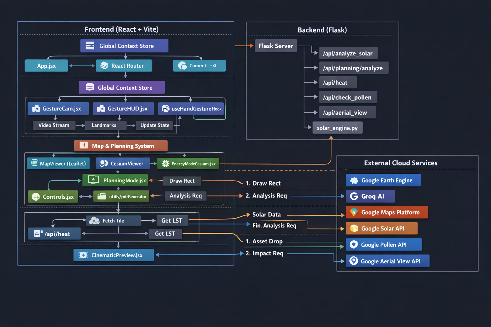

# 🌍 GeoCortex: Advanced Urban Intelligence Platform

<div align="center">
  
  <h3><i>AI-Powered Geospatial Analysis for Sustainable Urban Planning</i></h3>
</div>

---

## 📖 Overview

**GeoCortex** is a cutting-edge geospatial platform that bridges the gap between urban planning, environmental analysis, and artificial intelligence. It empowers planners, architects, and policymakers to visualize, analyze, and optimize urban environments using real-time data.

By integrating **Google Earth Engine**, **Google Photorealistic 3D Tiles**, and **Generative AI (Groq)**, GeoCortex provides actionable insights on solar potential, urban heat islands (LST), and ecosystem impact—all within a seamless dual 2D/3D interface.

---

## 🚀 Key Features

### 🏙️ Immersive Visualization
- **Dual-Mode Mapping**: Synchronized 2D (Google Maps) and 3D (CesiumJS + Google 3D Tiles) views.
- **Cinematic Drone View**: Preview locations with high-fidelity pre-rendered aerial videos using **Google Aerial View API**.
- **Interactive Layers**: Toggle between Satellite, Thermal (LST), and varying terrain modes.

### ☀️ Energy & Solar Intelligence
- **Rooftop Solar Analysis**: Draw custom zones to calculate solar potential, panel capacity, and financial ROI.
- **AI Investment Reports**: Get simplified, data-driven investment advice generated by **Groq LLM** based on solar data.

### 🏗️ Intelligent Planning Mode
- **Drag-and-Drop Assets**: Place 3D models (Trees, Buildings, Ponds) directly onto the map.
- **Real-time Impact Analysis**: Instantly calculate how new assets affect local Land Surface Temperature (LST).
- **Pollen Viability Check**: Automatically checks **Google Pollen API** to warn against planting in high-allergen areas.
- **Microclimate Reports**: Generate detailed PDF reports on environmental impact.

### 🤖 AI Consultant
- **Context-Aware Chatbot**: Ask questions about the current map view (e.g., "Why is this area so hot?") and receive answers backed by Earth Engine data.

### 👆 Gesture Navigation
- **Hands-Free Control**: Switch map modes (Thermal/Satellite) using hand gestures powered by **MediaPipe**.

---

## 🏗️ Architecture

GeoCortex uses a modern Client-Server architecture designed for high-performance geospatial rendering.



---

## 🛠️ Tech Stack

### Frontend
- **Framework**: React 18, Vite
- **Styling**: Tailwind CSS, PostCSS
- **Maps & 3D**: 
  - `cesium`: Visualization of Google Photorealistic 3D Tiles.
  - `@deck.gl/google-maps`: High-performance WebGL overlays.
  - `@googlemaps/js-api-loader`: Google Maps JS API.
- **AI & Vision**: `@mediapipe/tasks-vision`.
- **Utilities**: `axios`, `gsap` (Animations), `jspdf` (Reporting).

### Backend
- **Framework**: Flask (Python)
- **Geospatial**: `earthengine-api` (Google Earth Engine).
- **AI**: `groq` (Llama 3 inference).
- **Utilities**: `reportlab` (PDF Generation), `python-dotenv`.

---

## ⚙️ Prerequisites

Before running the project, ensure you have the following:

1.  **Node.js** (v18+) and **npm**.
2.  **Python** (v3.9+).
3.  **Google Cloud Service Account** with Earth Engine enabled.
4.  **API Keys**:
    - `VITE_GOOGLE_MAPS_API_KEY`: (Maps JS, Places, Geocoding).
    - `GOOGLE_SOLAR_API_KEY`
    - `GOOGLE_POLLEN_API_KEY`
    - `GOOGLE_AERIAL_VIEW_API_KEY`
    - `GROQ_API_KEY`: For AI features.

---

## ⚡ Installation & Setup

### 1. Backend Setup

```bash
# Navigate to the root directory
cd GeoCortex

# Create a virtual environment
python -m venv .venv

# Activate the virtual environment
# Windows:
.venv\Scripts\activate
# Mac/Linux:
source .venv/bin/activate

# Install dependencies
pip install -r requirements.txt
```

### 2. Frontend Setup

```bash
# Navigate to client directory
cd client

# Install dependencies
npm install
```

### 3. Environment Configuration

Create a `.env` file in the **root** execution directory (where `server.py` is) AND in `client/` (for Vite).

**Root `.env` (Backend):**
```env
GROQ_API_KEY=your_groq_key
GOOGLE_SOLAR_API_KEY=your_solar_key
GOOGLE_POLLEN_API_KEY=your_pollen_key
GOOGLE_AERIAL_VIEW_API_KEY=your_aerial_key
```

**Client `.env` (Frontend):**
```env
VITE_GOOGLE_MAPS_API_KEY=your_maps_key
VITE_GOOGLE_AERIAL_VIEW_KEY=your_aerial_key
```

*Note: Ensure you place your Google Earth Engine `credentials.json` in the root directory.*

---

## 🏃 Usage

### 1. Start the Backend Server
```bash
# From root directory
python server.py
```
*Server runs on http://localhost:5000*

### 2. Start the Frontend Application
```bash
# From client directory
npm run dev
```
*Client runs on http://localhost:5173*

### 3. Explore
- Open the browser to the local client URL.
- Use **Planning Mode** to simulate urban changes.
- Use **Drone View** to see cinematic previews.
- Toggle **GESTURE** controls to navigate hands-free!

---

## 🤝 Contributing

Contributions are welcome! Please follow these steps:
1.  Fork the repository.
2.  Create your feature branch (`git checkout -b feature/AmazingFeature`).
3.  Commit your changes (`git commit -m 'Add some AmazingFeature'`).
4.  Push to the branch (`git push origin feature/AmazingFeature`).
5.  Open a Pull Request.

---

## 📄 License

Distributed under the MIT License. See `LICENSE` for more information.

---

<div align="center">
  <sub>Built with ❤️ by the GeoCortex Team</sub>
</div>